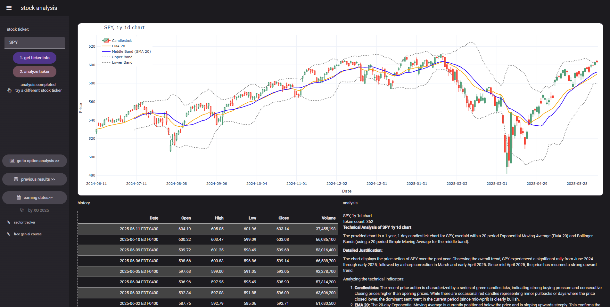
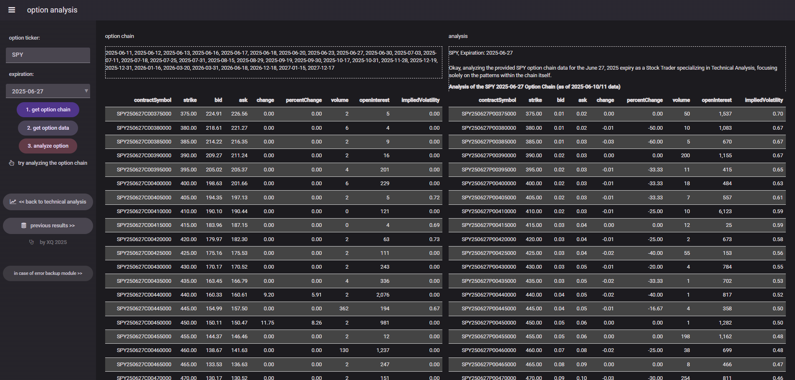
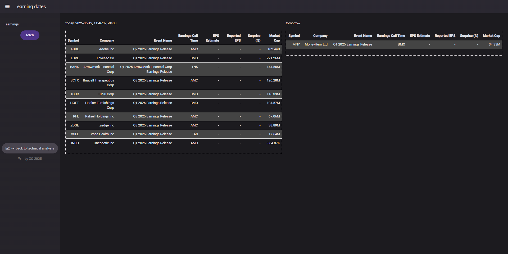

# 📈 Stock AI Analysis

## Unleash AI-Powered Insights into Stock Market Dynamics

This project demonstrates a powerful full-stack application for real-time stock market analysis, combining robust Python data processing with a user-friendly Anvil client interface. Leveraging the power of Google's Gemini AI, it provides insightful technical analysis of stock charts and option chains, helping users make informed trading decisions.

**Key Features:**

  * **Real-time Stock Charting:** Visualize historical stock data with technical indicators (EMA, Bollinger Bands) using `yfinance` and `Plotly`.
  * **AI-Powered Technical Analysis:** Get instant "Buy/Hold/Sell" recommendations and detailed justifications based on chart patterns and indicators, powered by Google's Gemini AI.
  * **Comprehensive Option Chain Analysis:** Explore call and put option data for various expiration dates, with AI-driven insights into market sentiment.
  * **Earnings Calendar:** Stay updated with upcoming earnings announcements from Yahoo Finance.
  * **Anvil Frontend:** A clean, interactive web interface built with Anvil for seamless user experience.
  * **Dockerized Backend:** A self-contained Python backend, ready for easy deployment and scaling.
  * **Demonstrates Advanced Python Skills:** Showcases expertise in data manipulation (`pandas`), web scraping (`BeautifulSoup`, `Selenium`), API integration (`yfinance`, `google-genai`), and charting (`Plotly`).

## 🚀 Live Demo





## 🛠️ Technologies Used

**Frontend:**

  * **Anvil:** Low-code web framework for building the user interface.

**Backend:**

  * **Python:** The core language for data processing, AI integration, and backend logic.
      * `yfinance`: For fetching stock data and option chains.
      * `pandas`: For data manipulation and analysis.
      * `plotly`: For generating interactive stock charts.
      * `google-genai`: For integrating with Google's Gemini AI for technical analysis.
      * `beautifulsoup4` & `selenium`: For web scraping option chain data (as a backup).
      * `anvil-uplink`: To connect the Anvil frontend to the Python backend.
  * **Docker:** For containerizing the Python backend, ensuring easy setup and portability.

## 💾 Data Storage

This application utilizes an Anvil Data Table to persist historical AI analysis responses.

**`Table` Schema:**

| Column Name | Type     | Description                                     | Access (Client) |
| :---------- | :------- | :---------------------------------------------- | :-------------- |
| `date`      | `datetime` | Timestamp of when the analysis was performed.   | Full access     |
| `response`  | `string`   | The AI's full analysis and recommendation.      | Full access     |
| `img`       | `media`    | (Future use/Optional) Placeholder for chart image. | Full access     |


## 📦 Repository Structure

```
stock-ai-analysis/
├── frontend/              # Anvil client project files
│   ├── Form1.py           # Main form for stock chart & AI analysis
│   ├── Form2.py           # Form for option chain analysis
│   ├── Form3.py           # Form for earnings calendar
│   └── ...                # Other Anvil related files
│
├── backend/               # Python backend and Docker setup
│   ├── app.py             # Main Python script with Anvil Uplink functions
│   ├── Dockerfile         # Docker build instructions for the backend
│   ├── requirements.txt   # Python dependencies
│   ├── docker-compose.yml # Defines Docker services for easy setup
│   ├── .env.example       # Template for environment variables (e.g., API keys)
│   └── ...                # Other Docker related files
│
├── .gitignore             # Specifies intentionally untracked files to ignore
├── README.md              # You are reading it!
└── LICENSE                # MIT License
```

## 🏁 Getting Started

To run this project locally, you will need to have Docker installed and an Anvil account (free tier is sufficient).

### 1\. Clone the Repository

```bash
git clone https://github.com/qinx04/stock-ai-analysis.git
cd stock-ai-analysis
```

### 2\. Set up the Backend (Docker)

Navigate to the `backend` directory:

```bash
cd backend
```

**Environment Variables:**

Create a `.env` file in the `backend` directory based on `.env.example`. This file will contain your API keys.

```bash
# .env
GOOGLE_API_KEY='YOUR_GOOGLE_GEMINI_API_KEY'
ANVIL_UPLINK_KEY='YOUR_ANVIL_UPLINK_KEY'
```

  * **Google Gemini API Key:** Obtain one from [Google AI Studio](https://aistudio.google.com/).
  * **Anvil Uplink Key:** You will get this from your Anvil app (see Frontend setup below).

**Build and Run the Docker Container:**

```bash
docker build -t stock-ai-analysis-backend .
docker run -d --name stock-ai-analysis-backend
```

### 3\. Set up the Frontend (Anvil)

1.  **Open Anvil:** Go to [Anvil Works](https://anvil.works/) and sign in.
2.  **Create a New App:** Choose to create a new app and select a blank app or suitable template.
3.  **Clone the Anvil App:**
      * In the Anvil Editor, go to `Version History` (the clock icon).
      * Click on `Clone from Git repository`.
      * Paste the HTTPS URL of your `anvil_frontend` directory from this GitHub repository (e.g., `https://github.com/qinx04/stock-ai-analysis/tree/main/anvil_frontend`).
      * Anvil will import your frontend code.
4.  **Connect to Uplink:**
      * In your Anvil app, click on the **'Add a Service'** button in the left sidebar, and select **'Uplink'**.
      * Follow the instructions to copy your **Uplink Key**.
      * Paste this key into the `ANVIL_UPLINK_KEY` variable in your `backend/.env` file.
      * Ensure the `anvil.server.connect('')` line in your `app.py` uses this key.

### 4\. Run the Application

  * **Backend:** Your Docker container should already be running.
  * **Frontend:** In the Anvil Editor, click the **'Run'** button (play icon) to launch your web application.

You should now be able to interact with the Stock AI Analysis tool\!

## 💡 How it Works

  * **Data Acquisition:** The Python backend uses `yfinance` to fetch real-time and historical stock data (candlestick charts, EMA, Bollinger Bands) and option chains. For option chains, it includes a robust fallback mechanism using `Selenium` and `BeautifulSoup` to scrape data from `optioncharts.io` or `finance.yahoo.com` if `yfinance` encounters issues.
  * **Charting:** `Plotly` is used to generate interactive and customizable candlestick charts with technical indicators, which are then passed to the Anvil frontend for display.
  * **AI Integration:** The `google-genai` library allows seamless communication with the Gemini AI model. Stock chart images and CSV data of option chains are sent to Gemini with carefully crafted prompts to elicit expert-level technical and market sentiment analysis.
  * **Anvil Uplink:** This powerful feature connects the Anvil frontend directly to the Python backend running on your local machine (or a server), enabling real-time data exchange and function calls. Background tasks in Anvil are used to handle long-running AI analysis requests without freezing the UI.


## 🤝 Contributing

Feel free to fork this repository, open issues, and submit pull requests. Contributions are welcome\!


## 📄 License

This project is licensed under the MIT License - see the [LICENSE](https://www.google.com/search?q=LICENSE) file for details.
